# DADS5001 Mini Project การวิเคราะห์ผลการเลือกตั้งปี 2569
การวิเคราะห์นี้จัดทำขึ้นบนฐานข้อมูลการเลือกตั้งสมาชิกสภาผู้แทนราษฎร (สส.) จำนวน 500 ที่นั่ง (แบ่งเขต 400 ที่นั่ง, บัญชีรายชื่อ 100 ที่นั่ง) โครงสร้างอำนาจทางการเมืองไทยกำลังเผชิญกับการจัดระเบียบใหม่ ข้อมูลเชิงประจักษ์ชี้ให้เห็นถึงอิทธิพลของระบบบ้านใหญ่ ประสิทธิภาพของการแลนด์สไลด์เชิงพื้นที่ และพฤติกรรมผู้มีสิทธิเลือกตั้งที่เปลี่ยนแปลงไปอย่างมีนัยสำคัญ บทความนี้มุ่งถอดรหัสข้อมูลเพื่อประเมินความเสี่ยงและกำหนดทิศทางเชิงยุทธศาสตร์สำหรับการเมืองในอนาคต

# สารบัญ
- [ภาพรวมของการเลือกตั้งปี 2569](#ภาพรวมของการเลือกตั้งปี-2569)
- [การวิเคราะห์อิทธิพลของบ้านใหญ่ต่อการเลือกตั้ง สส](#การวิเคราะห์อิทธิพลของบ้านใหญ่ต่อการเลือกตั้ง-สส)
- [การวิเคราะห์พฤติกรรมการลงคะแนนของผู้มีสิทธิ์เลือกตั้งในปี 2569](#การวิเคราะห์พฤติกรรมการลงคะแนนของผู้มีสิทธิ์เลือกตั้งในปี-2569)

# ภาพรวมของการเลือกตั้งปี 2569

  

<em>รูปที่ 1.1 กราฟแสดงจำนวนผู้ใช้สิทธิเลือกตั้ง (Turnout) และไม่มาใช้สิทธิเลือกตั้ง (No Show) และจำนวนบัตรดี (Valid) บัตรเสีย (Invalid) และไม่ประสงค์ลงคะแนน (No Vote) ปี 2569</em>

- จากจำนวนผู้มีสิทธิเลือกตั้งทั้งหมด 52.92 ล้านคน มีผู้มาใช้สิทธิเพียง 34.63 ล้านคน (65.4%) ในขณะที่กลุ่ม "ผู้ไม่มาใช้สิทธิ" (No Show) มีจำนวนมากถึง 18.29 ล้านคน (34.6%) สัดส่วนประชากรมากกว่าหนึ่งในสามที่หายไปจากระบบนี้ ไม่ใช่เพียงความเพิกเฉย (Apathy) แต่สามารถประเมินได้ถึงความเชื่อมั่นต่อสถานการณ์ทางการเมืองได้ด้วย
- จากจำนวนผู้มาใช้สิทธิทั้งหมด มีบัตรดี (Valid Vote) 31.95 ล้านใบ (92.3%) จุดที่ต้องเฝ้าระวังคือ สัดส่วนของบัตรเสีย (Invalid Vote) ที่มีถึง 1.23 ล้านใบ (3.6%) ซึ่งสะท้อนถึงความซับซ้อนของกลไกการเลือกตั้งที่ยังเข้าไม่ถึงประชาชนทุกกลุ่ม และที่สำคัญคือกลุ่มที่ตั้งใจเลือก "ไม่ประสงค์ลงคะแนน" (No Vote) ซึ่งมีจำนวนสูงถึง 1.45 ล้านใบ (4.2%) เป็นการแสดงออกถึงการปฏิเสธตัวเลือกทางการเมืองชัดเจน (Active Rejection)

  

<em>รูปที่ 1.2 กราฟแสดงข้อมูลเปรียบเทียบระหว่างผู้ใช้สิทธิเลือกตั้ง (Turnout) และไม่มาใช้สิทธิเลือกตั้ง (No Show) ระหว่างปี 2566 และปี 2569</em>

จากข้อมูลของสำนักงานคณะกรรมการการเลือกตั้ง (กกต.) ระบุว่า มีจำนวนผู้มีสิทธิเลือกตั้งสมาชิกสภาผู้แทนราษฎร (สส.) ทั่วประเทศ ทั้งสิ้น 52,922,923 คน แต่พบว่ามีเพียง 34,632,581 คน หรือคิดเป็น 65.4% เท่านั้นที่ออกมาใช้สิทธิการเลือกตั้ง และเมื่อเทียบกับปี 2566 ที่มีจำนวน 52,287,045 คนและมีผู้ใช้สิทธิทั้งหมด 39,514,973 คนหรือ 75.57% ทำให้เห็นว่ามีสัดส่วนที่ลดลงมากถึง 10.17% ซึ่งแสดงให้เห็นถึงพฤติกรรมที่เปลี่ยนไปของผู้มีสิทธิเลือกตั้ง

  

<em>รูปที่ 1.3 กราฟแสดงข้อมูลเปรียบเทียบจำนวนบัตรดี (Valid) บัตรเสีย (Invalid) และไม่ประสงค์ลงคะแนน (No Vote) ระหว่างปี 2566 และปี 2569</em>

เมื่อแยกตามประเภทของการลงคะแนนเสียงแล้วจะทำให้พบว่า
- บัตรดี มีจำนวนที่ลดลงมากถึง 5,238,159 ใบหรือคิดเป็นสัดส่วน 14.1%
- บัตรเสีย มีจำนวนที่ลดลง 223,842 ใบหรือคิดเป็นสัดส่วน15.4% แสดงถึงแนวโน้มที่ดีขึ้น
- ไม่ประสงค์ลงคะแนน มีจำนวนที่เพิ่มขึ้นถึง 964,364 ใบหรือคิดเป็นสัดส่วน 200%
ถึงแม้ว่าจำนวนบัตรเสียจะมีแนวโน้มที่ดีขึ้น แต่ก็ยังคงต้องเฝ้าระวังบัตรดีที่ลดลงและไม่ประสงค์ลงคะแนนที่เพิ่มขึ้นด้วย

  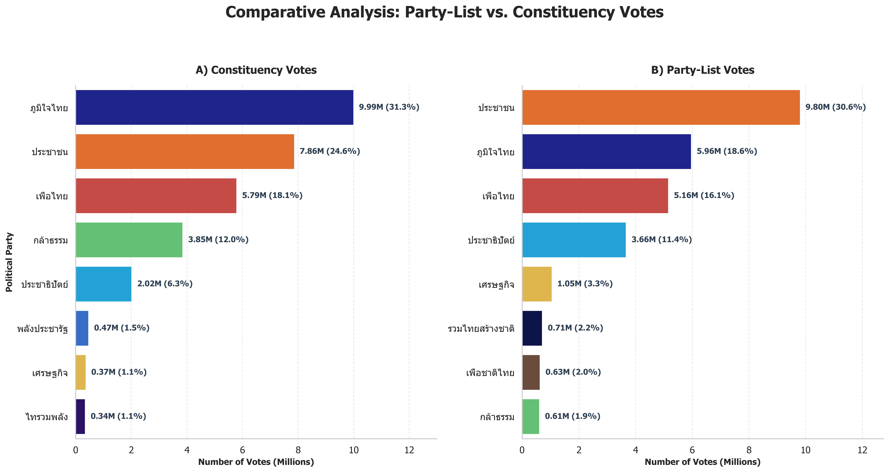

<em>รูปที่ 1.4 กราฟแสดง A) ผลรวมคะแนนเสียงของ สส.บัญชีรายชื่อ (Party-list MPs) แบ่งตามพรรค และ B) ผลรวมคะแนนเสียงของ สส.แบ่งเขต (Constituency MPs) เลือกตั้งแบ่งตามพรรค</em>

- พรรคประชาชน: ข้อมูลชี้ชัดว่าครองความนิยมระดับพรรคสูงสุด (รูป 1.4 A) ที่ 9.80 ล้านเสียง (30.6%) แต่ประสบปัญหาในการรักษาฐานเสียงระดับเขต โดยคะแนนลดลงเหลือ 7.86 ล้านเสียง (รูป 1.4 B) ตัวเลขนี้ยืนยันว่าผู้มีสิทธิเลือกตั้งสนับสนุนอุดมการณ์ของพรรค แต่ไม่ได้เลือกผู้สมัครของพรรคในระดับพื้นที่ในสัดส่วนที่เท่ากัน
- พรรคภูมิใจไทย: มีทิศทางสวนทางอย่างชัดเจน กวาดคะแนน สส. แบ่งเขตได้สูงสุดเป็นอันดับหนึ่งถึง 9.99 ล้านเสียง (รูป 1.4 B) แต่คะแนนความนิยมระดับพรรคกลับวูบลงเหลือเพียง 5.96 ล้านเสียง (รูป 1.4 A) แสดงให้เห็นถึงความสามารถของผู้สมัครในการดึงดูดคะแนนเสียงในพื้นที่ ซึ่งมีอิทธิพลเหนือกว่าภาพลักษณ์แบรนด์ของพรรค
- พรรคกล้าธรรม: เป็นกรณีศึกษาที่สะท้อนความแตกต่างของคะแนนสองระบบแบบสุดโต่ง โดยมีคะแนน สส. แบ่งเขตสูงถึง 3.85 ล้านเสียง (รูป 1.4 B) แต่คะแนนบัญชีรายชื่อกลับรั้งท้ายที่ 0.61 ล้านเสียง (รูป 1.4 A) เป็นหลักฐานเชิงประจักษ์ของการได้คะแนนเสียงจากกลไกตัวบุคคลในพื้นที่โดยแทบไม่มีความยึดโยงกับตัวพรรค
- พรรคเพื่อไทย: เป็นพรรคเดียวที่รักษาสมดุลของฐานเสียงได้ โดยมีสัดส่วนคะแนนทั้งสองระบบเกาะกลุ่มกันที่ 5.16 ล้านเสียง (บัญชีรายชื่อ) และ 5.79 ล้านเสียง (แบ่งเขต)

  

<em>รูปที่ 1.5 กราฟแสดงการเปรียบเทียบระหว่างจำนวนที่นั่ง สส.แบ่งเขต (Constituency MPs) และ สส.บัญชีรายชื่อ (Party-list MPs)</em>

- พรรคภูมิใจไทยสามารถแปลงคะแนนเสียงเขตที่สูงสุด (จากรูป 1.4 B) ให้เป็นที่นั่ง สส. เขตได้ถึง 174 ที่นั่ง (รูป 1.5) เมื่อรวมกับบัญชีรายชื่อ 19 ที่นั่ง จึงกุมความได้เปรียบเบ็ดเสร็จที่ 193 ที่นั่ง ในทำนองเดียวกัน พรรคกล้าธรรมใช้คะแนนเขต 3.85 ล้านเสียง กวาดที่นั่ง สส. เขตไปได้ถึง 56 ที่นั่ง รวมเป็น 58 ที่นั่ง
- แม้พรรคประชาชนจะชนะคะแนนปาร์ตี้ลิสต์ขาดลอยและได้ สส. บัญชีรายชื่อสูงสุดถึง 31 ที่นั่ง (รูป 1.5) แต่การได้ สส. เขตเพียง 87 ที่นั่ง ทำให้ผลรวม (118 ที่นั่ง) ไม่สามารถก้าวขึ้นเป็นพรรคอันดับหนึ่งในสภาได้ ข้อมูลนี้ยืนยันว่าภายใต้กติกานี้ กระแสไม่สามารถชดเชยความพ่ายแพ้ในระบบเขตได้
- พรรคเพื่อไทย (รวม 74 ที่นั่ง) และพรรคประชาธิปัตย์ (รวม 22 ที่นั่ง) มีโครงสร้างที่นั่งที่พึ่งพาระบบเขตเป็นหลัก (58 และ 12 ที่นั่งตามลำดับ) ซึ่งสอดคล้องกับข้อจำกัดในการดึงคะแนนเสียงที่ปรากฏในรูป 1.4 A

  

<em>รูปที่ 1.6 กราฟแสดงเมทริกซ์การกระจายตัวของที่นั่ง สส. แบ่งเขตรายภูมิภาค</em>

- พรรคภูมิใจไทยครอบครองพื้นที่ขนาดใหญ่ที่สุด โดยเฉพาะภาคอีสาน (64 เขต) ภาคกลาง (45 เขต) และภาคใต้ (31 เขต) ประสบความสำเร็จสูงสุดในการใช้กลไก "บ้านใหญ่และเครือข่ายท้องถิ่น" กวาดที่นั่งในต่างจังหวัดได้อย่างเบ็ดเสร็จ แต่ก็ไม่สามารถใช้ได้ผลกับกรุงเทพที่ถูกครองโดยพรรคประชาชน ซึ่งมีแนวโน้มว่าจะเป็นอุปสรรคหลักของพรรค
- พรรคประชาชนกวาดที่นั่งในกรุงเทพฯทั้งหมด 33 ที่นั่ง และทำได้ดีในภาคกลาง (24 เขต) แต่ในภาคใต้ ภาคอีสานและภาคตะวันออกกลับได้แค่ 2 เขต, 6 เขตและ 8 เขตตามลำดับเท่านั้น แสดงให้เห็นว่าพรรคประชาชนยังไม่สามารถเจาะโครงสร้างของระบบอุปถัมป์ที่มีอยู่ก่อนแล้วได้
- พรรคกล้าธรรม เป็นม้ามืดที่น่าสนใจ กราฟแสดงให้เห็นว่าพวกเขาไม่ได้ครองแชมป์ในภูมิภาคใดเลย แต่ใช้วิธีเจาะพื้นที่กระจายตัว (เหนือ 17, อีสาน 13, ใต้ 12, กลาง 5) นี่คือการใช้ทรัพยากรเจาะเฉพาะเขตที่มีโอกาสชนะ (Micro-targeting) ทำให้มีที่นั่งรวมสูงและกลายเป็นตัวแปรสำคัญในการร่วมรัฐบาล

  

<em>รูปที่ 1.7 แผนที่พรรคการเมืองที่ได้คะแนนบัญชีรายชื่อสูงสุดรายจังหวัด</em>

- พรรคประชาชน ถือครองพื้นที่ส่วนใหญ่ของประเทศตั้งแต่ภาคเหนือ ภาคกลาง ภาคตะวันออก ภาคตะวันตก และเข้าไปในภาคอีสาน เป็นผลลัพธ์ที่ชัดเจนว่าได้รับกระแสนิยมที่ค่อนข้างชัดเจน แม้ในจังหวัดจะแพ้ให้กับสส.ท้องถิ่นก็ตาม แต่เมื่อถึงเวลาเลือกสส.บัญชีรายชื่อกลับได้รับเลือก ซึ่งถือเป็นจุดแข็งของพรรคประชาชน
- พรรคภูมิใจไทย แม้จะมี สส. เขตมากที่สุดในสภา (174 ที่นั่ง) แต่จุดสีน้ำเงินเข้มในแผนที่นี้กลับปรากฏขึ้นเพียงหย่อมเล็กๆ ซึ่งเป็นการแสดงให้เห็นว่าประชาชนเลือกพรรคภูมิใจไทยที่ตัวบุคคลมากกว่าในนโยบายพรรค

  

<em>รูปที่ 1.8 สัดส่วนคะแนนที่ได้ผู้แทน (Used Vote) เทียบกับ คะแนนที่สูญเปล่า (Wasted Vote)</em>

จากจำนวนผู้มาใช้สิทธิทั้งหมด มีบัตรดีที่เป็น "คะแนนตกน้ำ" (Wasted Votes) สูงถึง 39.6% (20.97 ล้านเสียง) เมื่อเทียบกับคะแนนที่ถูกนำมาคำนวณที่นั่งจริง (Used Votes) 60.4% (31.95 ล้านเสียง) สะท้อนถึงข้อจำกัดของระบบผู้ชนะกินรวบ (First-Past-The-Post)

# การวิเคราะห์อิทธิพลของบ้านใหญ่ต่อการเลือกตั้ง สส

  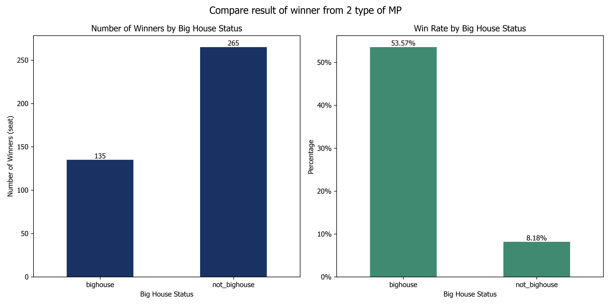

<em>รูปที่ 1.1 กราฟแสดงข้อมูลเปรียบเทียบระหว่างจำนวนผู้ได้เก้าอี้ สส (Number of Winner(seat)) กับสัดส่วนการได้เก้าอี้ สส (Percentage) โดยแบ่งตาม big house status </em>

จะพบว่า สส ที่ได้เก้าอี้ทั้งหมดในประเทศไทยซึ่งเราได้ทำการแบ่งวิเคราะห์เป็น 2 กลุ่มคือ สส ที่เป็นบ้านใหญ่และ สส ที่ไม่ได้เป็นบ้านใหญ่ จากรูปที่ 1.1 จะพบว่าถ้านับตามจำนวนเก้าอี้ผู้ชนะ สส เราจะเห็นว่า สส ที่ไม่ได้เป็น bighouse มีจำนวนเก้าอี้มากกว่าถึง 146 เก้าอี้ แต่ถ้าเรามองในมุมมองของสัดส่วนของผู้ที่ได้เก้าอี้ในแต่ละกลุ่มเราจะพบว่าจำนวนของผู้สมัคร สส ที่เป็นบ้านใหญ่นั้นมีสัดส่วนการได้เก้าอี้ต่อจำนวนบ้านใหญ่ทั้งหมดถึง 57.21% ซึ่งแตกต่างจาก สส ที่ไม่ได้เป็นบ้านใหญ่ที่ได้เก้าอี้ที่ได้สัดส่วนที่ 8.35% จึงทำให้เห็นถึงอิทธิพลของบ้านใหญ่ที่ส่งผลต่อการได้เก้าอี้ สส เพราะแม้ว่าจะเป็นคนกลุ่มน้อยแต่ก็เป็นกลุ่มที่สามารถดึงเก้าอี้ไปได้ถึง 127 เก้าอี้ สส

  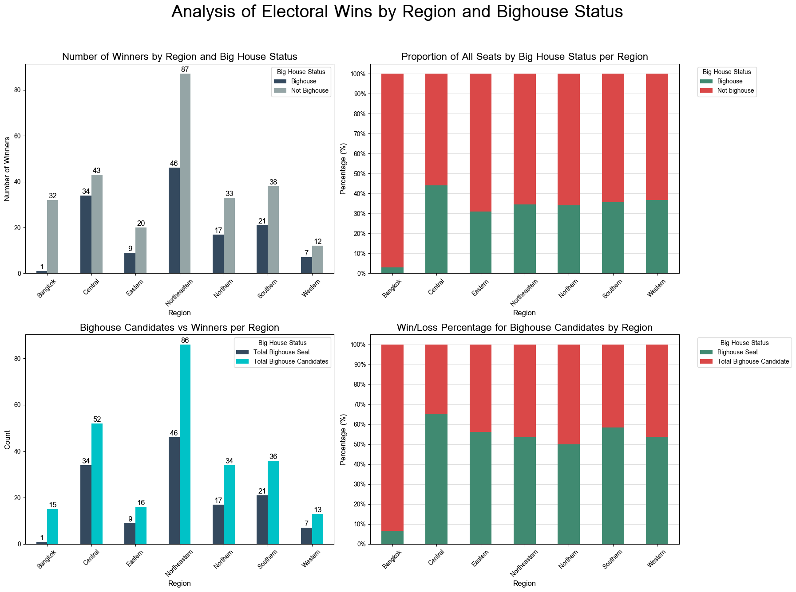

<em>รูปที่ 1.2 กราฟการวิเคราะห์ผลการเลือกตั้งจำแนกตามภูมิภาคและสถานะบ้านใหญ่ (Big House) ประกอบด้วย (บนซ้าย) จำนวน สส ที่ได้เก้าอี้แยกตามสถานะบ้านใหญ่, (บนขวา) สัดส่วนสส ที่ได้เก้าอี้ที่เป็นบ้านใหญ่ต่อ สส ที่ได้เก้าอี้ทั้งหมดในแต่ละภูมิภาค, (ล่างซ้าย) การเปรียบเทียบระหว่างจำนวน สส ทั้งหมดและ สส ที่ได้เก้าอี้ที่เป็นบ้านใหญ่ และ (ล่างขวา) อัตราการได้เก้าอี้ สส (Win Rate) ของผู้สมัครกลุ่มบ้านใหญ่ </em>

เมื่อทำการวิเคราะห์ลงไปถึงรายภูมิภาคจะพบว่าแต่ละภูมิภาคจะมีอิทธิพลของบ้านใหญ่อยู่มากกว่า 30% ยกเว้นแค่ในส่วนของกรุงเทพมหานครที่มีพฤติกรรมที่แตกต่าง ซึ่งอาจเกิดมาจากปัจจัยเชิงคุณภาพอื่นๆ นอกจากนี้จากรูปที่ 1.2 จะพบว่าภาคตะวันออกเฉียงเหนือมีจำนวนของ สส บ้านใหญ่ที่เยอะเป็นอันดับที่ 1 รองลงมาอันดับที่ 2 จะเป็นภาคกลาง ตามมาด้วยอันที่ 3, 4 ที่มีค่าใกล้เคียงกันคือภาคเหนือและภาคใต้ตามลำดับ แต่ถ้ามองในด้านของความผูกขาดของ สส บ้านใหญ่ภาคกลางและภาคใต้ก็จะมีความผูกขาดสูงกว่าภาคอื่นๆ โดยสัดส่วนของ สส บ้านใหญ่ที่ได้ที่นั่งต่อ สส บ้านใหญ่ทั้งหมดที่สูงกว่า 50%

  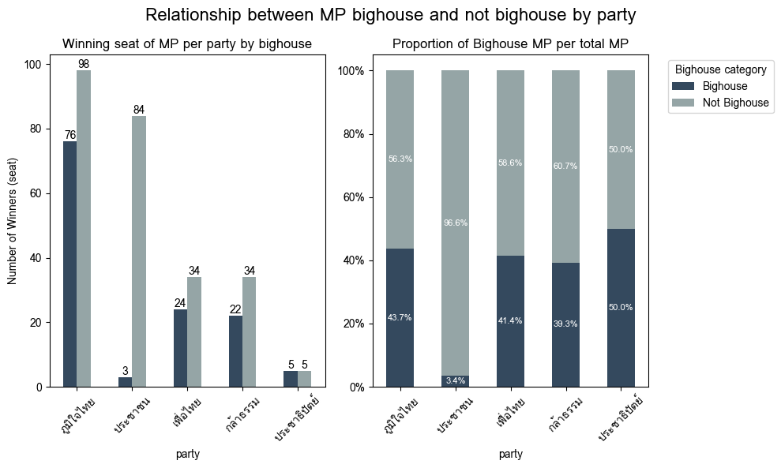

<em>รูปที่ 1.3 กราฟแสดงสัดส่วนของจำนวน สส บ้านใหญ่ที่ได้ที่นั่งต่อจำนวน สส ที่ได้ที่นั่งทั้งหมดในพรรคที่เป็น Top 5 ในการเลือกตั้ง สส แบ่งเขต</em>

จากรูปที่ 1.3 จะพบว่าแต่ละพรรคมีสัดส่วนของ สส บ้านใหญ่เยอะที่ได้ที่นั่งมากกว่า 30 % ถึง 4 พรรค และสูงสุดที่ 42.5% ที่เป็นของพรรคภูมิใจไทย และลองลงมาเป็นพรรคเพื่อไทยที่มีสัดส่วนของ สส บ้านใหญ่เท่ากับ 41.4% ซึ่งจะมองได้ว่าบ้านใหญ่มีอิทธิพลต่อคะแนนของพรรคอย่างเห็นได้ชัด ยกเว้นพรรคประชาชนที่มีสัดส่วนของ สส บ้านใหญ่ที่ต่ำ และถ้าดูในเรื่องของจำนวนของ สส บ้านใหญ่ที่ได้เก้าอี้ในแต่ละพรรคจะพบว่าในพรรคภูมิใจมีสูงถึง 74 คนในพรรคเดียวซึ่งมากกว่า สส ที่ได้ที่นั่งทั้งหมดของพรรคเพื่อไทย พรรคกล้าธรรม พรรคประชาธิปัตย์อย่างชัดเจน

  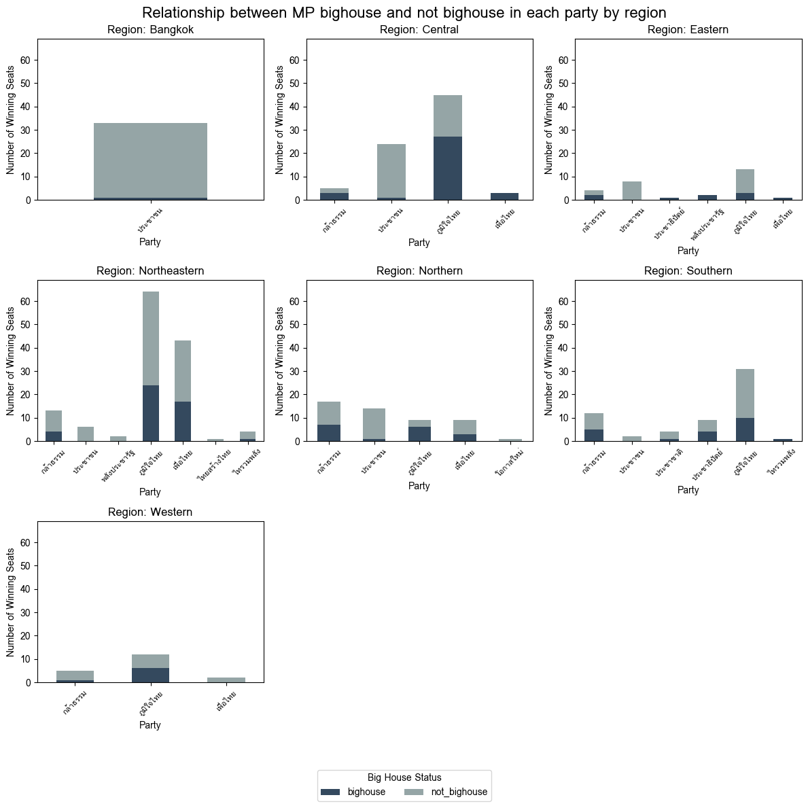

<em>รูปที่ 1.4 กราฟแสดงจำนวนของ สส ที่ได้เก้าอี้โดยแบ่งเป็น สส บ้านใหญ่และ สส ที่ไม่ได้เป็นบ้านใหญ่ของแต่ละพรรคในภูมิภาคต่างๆ</em>

จากรูปที่ 1.4 เราจะเห็นว่าพรรคภูมิใจไทยมี สส บ้านใหญ่ค่อนข้างมากในภูมิภาคตะวันออกเฉียงเหนือ (Northeastern) และภาคกลาง (Central) ซึ่งแสดงให้เห็นถึงการพึ่งพาเครือข่ายบ้านใหญ่อย่างชัดเจนโดยเฉพาะในภาคกลาง และยังมีสัดส่วนผู้ชนะที่เป็นบ้านใหญ่เท่ากับครึ่งหนึ่งหรือมากกว่าครึ่งของจำนวนที่นั่งที่พรรคที่ได้รับ ซึ่งจะประกอบไปด้วย ภาคกลางที่มีสัดส่วน 55.56% ภาคเหนือที่มีสัดส่วน 66.67% ภาคตะวันตกที่มีสัดส่วน 50% ในส่วนของพรรคเพื่อไทยจะมีจำนวนบ้านใหญ่เยอะอยู่ที่ภาคตะวันออกเฉียงเหนือ และจะเห็นได้ชัดว่าจำนวนที่นั่งที่มาจากภาคกลางและภาคตะวันออกมาจากบ้านใหญ่ทั้งสิ้น

# การวิเคราะห์พฤติกรรมการลงคะแนนของผู้มีสิทธิ์เลือกตั้ง

  ในส่วนนี้จะแสดงให้เห็นภาพที่ชัดเจนของพฤติกรรมการลงคะแนนของผู้มีสิทธิ์เลือกตั้งในประเทศไทย ด้วยรูปแบบการเลือกตั้งของประเทศไทยใช้ระบบบัตรเลือกตั้ง 2 ใบ ซึ่งเปิดโอกาสให้ผู้มีสิทธิ์เลือกทั้ง “ผู้สมัครแบบแบ่งเขต” และ “พรรคการเมืองแบบบัญชีรายชื่อ” ได้อย่างอิสระ ระบบนี้ทำให้เกิดคำถามว่า ในการตัดสินใจจริง ผู้มีสิทธิ์เลือกตั้งให้ความสำคัญกับ “ตัวบุคคล” หรือ “พรรคการเมือง” มากกว่ากัน

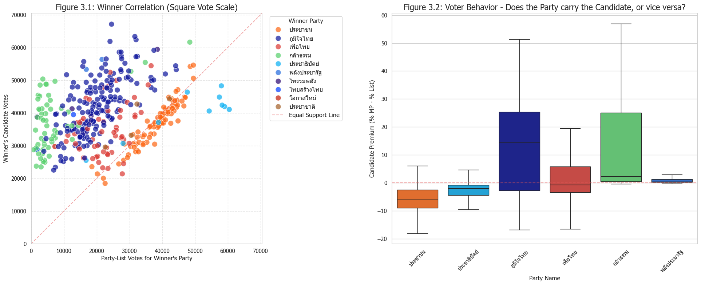

<em>รูปที่ 3.1 ความสัมพันธ์ระหว่างคะแนนผู้ชนะในเขตกับคะแนนบัญชีรายชื่อของพรรค รูปที่ 3.2 ดัชนีความได้เปรียบของผู้สมัคร (Candidate Premium) และการเปรียบเทียบกับคะแนนพรรค</em>

  ในรูปที่ 3.1 เป็น scatter plot ที่แสดงความสัมพันธ์ระหว่าง “คะแนนของผู้สมัครที่ชนะในเขตเลือกตั้ง” กับ “คะแนนบัญชีรายชื่อของพรรคเดียวกัน” ในแต่ละพื้นที่ โดยมีเส้นอ้างอิง (Equal Support Line) ที่แสดงกรณีที่คะแนนทั้งสองประเภทเท่ากัน จากกราฟพบว่า พรรคประชาชนมีจุดข้อมูลกระจุกตัวใกล้เส้นดังกล่าวอย่างชัดเจน สะท้อนว่าผู้มีสิทธิเลือกตั้งมักลงคะแนนให้ทั้งผู้สมัครและพรรคในทิศทางเดียวกัน ขณะที่พรรคกล้าธรรมและพรรคภูมิใจไทยมีจุดกระจายตัวอยู่เหนือเส้นเป็นส่วนใหญ่ หมายความว่าผู้สมัครได้คะแนนสูงกว่าพรรคอย่างมีนัยสำคัญ
รูปแบบนี้สะท้อน “ความสอดคล้องของการลงคะแนน (vote alignment)” ที่แตกต่างกันระหว่างพรรค
- พรรคที่มีคะแนนเกาะเส้น แสดงถึงฐานเสียงที่มีความภักดีต่อพรรค และตัดสินใจแบบสอดคล้องกัน
- พรรคที่มีคะแนนผู้สมัครสูงกว่าพรรค แสดงถึงการพึ่งพาความนิยมส่วนบุคคลของผู้สมัคร
  กราฟนี้จึงเป็นหลักฐานของการแบ่งแยกระหว่าง การเลือกแบบยึดโยงกับพรรค “party-centered voting” และ การเลือกแบบยึดโยงกับผู้สมัคร “candidate-centered voting” ในระบบการเลือกตั้ง

  ในรูปที่ 3.2 ใช้ตัวชี้วัดเพื่อแยกแยะว่าความนิยมมาจากตัวบุคคลหรือพรรค โดยคำนวณจากสูตร:
Candidate Premium = (% คะแนนผู้สมัครที่ชนะ) - (% คะแนนพรรคแบบบัญชีรายชื่อ)
  ค่าที่เป็นบวกหมายถึงผู้สมัครมีคะแนนสูงกว่าพรรค (ความนิยมมาจากตัวบุคคล) ขณะที่ค่าติดลบหมายถึงพรรคมีคะแนนสูงกว่าผู้สมัคร (ความนิยมมาจากแบรนด์พรรค)
  จากข้อมูลจริง พรรคประชาชนมีค่า median เป็นลบ สะท้อนว่าพรรคมีบทบาทสำคัญในการดึงคะแนนให้ผู้สมัคร ในขณะที่พรรคภูมิใจไทยและกล้าธรรมมีค่าเป็นบวกสูง แสดงว่าผู้สมัครเป็นตัวขับเคลื่อนคะแนนหลัก
ดัชนีนี้ช่วยแยก “แหล่งที่มาของความนิยมทางการเมือง” ได้อย่างชัดเจน
- ค่าติดลบ → การเมืองแบบยึดโยงพรรค
- ค่าบวก → การเมืองแบบยึดโยงบุคคล

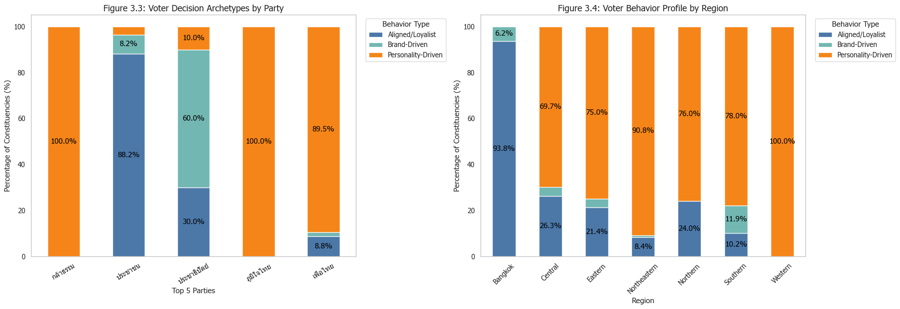

<em>รูปที่ 3.3 การจำแนกประเภทพฤติกรรมการตัดสินใจของผู้มีสิทธิเลือกตั้ง รูปที่ 3.4 โครงสร้างพฤติกรรมผู้มีสิทธิเลือกตั้งจำแนกตามภูมิภาค</em>

ในรูปที่ 3.3 นี้แบ่งผู้มีสิทธิเลือกตั้งออกเป็น 3 กลุ่มหลักตามพฤติกรรมการลงคะแนน ได้แก่
1. Aligned/Loyalist: เลือกทั้งผู้สมัครและพรรคเดียวกันอย่างสอดคล้อง
2. Brand-Driven: ให้ความสำคัญกับพรรคมากกว่าตัวผู้สมัคร
3. Personality-Driven: เลือกตามตัวบุคคล โดยไม่ยึดโยงกับพรรค

  จากข้อมูลพบว่า พรรคประชาชนมีสัดส่วนผู้เลือกแบบ Aligned/Loyalist สูงมาก ขณะที่พรรคภูมิใจไทยและกล้าธรรมพึ่งพาผู้เลือกแบบ Personality-Driven เกือบทั้งหมด และพรรคเพื่อไทยก็มีลักษณะใกล้เคียงกัน
สะท้อนว่า “ฐานเสียงของแต่ละพรรคไม่ได้เหมือนกันในเชิงพฤติกรรม”
- พรรคที่มี Aligned/Loyalist สูง แปลว่าผู้เลือกมีความเชื่อมโยงเชิงอุดมการณ์กับพรรค และมีความสม่ำเสมอในการลงคะแนน
- พรรคที่พึ่งพา Personality-Driven แสดงถึงการเมืองแบบเครือข่ายท้องถิ่นซึ่งตัวผู้สมัครมีบทบาทสำคัญมากกว่านโยบายพรรค

ในรูปที่ 3.4 แสดงสัดส่วนของผู้มีสิทธิเลือกตั้งแต่ละประเภท (Aligned/Loyalist, Brand-Driven, Personality-Driven) แยกตามภูมิภาค พบว่า
- ในเขตกรุงเทพมหานครมีสัดส่วน Aligned/Loyalist สูงมาก (มากกว่า 90%)
- ภูมิภาคอื่น เช่น ภาคอีสาน เหนือ กลาง และตะวันตก มีสัดส่วน Personality-Driven สูงอย่างชัดเจน
ผลลัพธ์นี้สะท้อนความแตกต่างเชิงโครงสร้างระหว่าง “เมือง” และ “ชนบท” อย่างชัดเจน
- ในเขตเมืองอย่างกรุงเทพฯ ผู้เลือกมีแนวโน้มตัดสินใจบนพื้นฐานของพรรค นโยบาย และอุดมการณ์
- ในพื้นที่ต่างจังหวัด ผู้เลือกให้ความสำคัญกับตัวบุคคล ความใกล้ชิด และอิทธิพลในพื้นที่มากกว่า
จากภาพจะสามารถสรุปได้ว่า พฤติกรรมผู้เลือกตั้งในประเทศไทยมีความแตกต่างกันตามภูมิศาสตร์ ซึ่งทำให้กลยุทธ์หาเสียงต้องแตกต่างกันอย่างมากในแต่ละพื้นที่

ภายใต้ระบบการเลือกตั้งแบบบัตรสองใบของประเทศไทย การที่ผู้มีสิทธิเลือกตั้งต้องลงคะแนนแยกระหว่างผู้สมัครแบบแบ่งเขตและพรรคแบบบัญชีรายชื่อ อาจเปิดช่องให้เกิดความคลาดเคลื่อนในการตัดสินใจ โดยเฉพาะในบริบทที่ผู้เลือกจำนวนมากยึดกับ “ตัวบุคคล” มากกว่าพรรคการเมือง
บทวิเคราะห์นี้ตั้งสมมติฐานว่า ผู้มีสิทธิเลือกตั้งบางส่วนมีพฤติกรรมแบบ “double-tick” คือ เมื่อเลือกผู้สมัครในเขตจากหมายเลขหนึ่งแล้ว มีแนวโน้มจะลงคะแนนในบัตรบัญชีรายชื่อโดยใช้หมายเลขเดียวกัน โดยไม่ได้พิจารณาความสอดคล้องของพรรคการเมือง ส่งผลให้คะแนนบัญชีรายชื่อบางส่วนถูกนับให้พรรคที่ไม่ได้เป็นตัวเลือกที่แท้จริงของผู้มีสิทธิเลือกตั้ง หากสมมติฐานนี้เป็นจริง เราคาดว่าจะพบว่าพรรคขนาดเล็กซึ่งมีหมายเลขตรงกับผู้สมัครที่ได้รับความนิยมในบางพื้นที่จะได้รับคะแนนเสียงในลักษณะที่ “พุ่งสูงผิดปกติ” และกระจุกตัวในเชิงพื้นที่ มากกว่าการกระจายตัวอย่างสม่ำเสมอทั่วประเทศ 

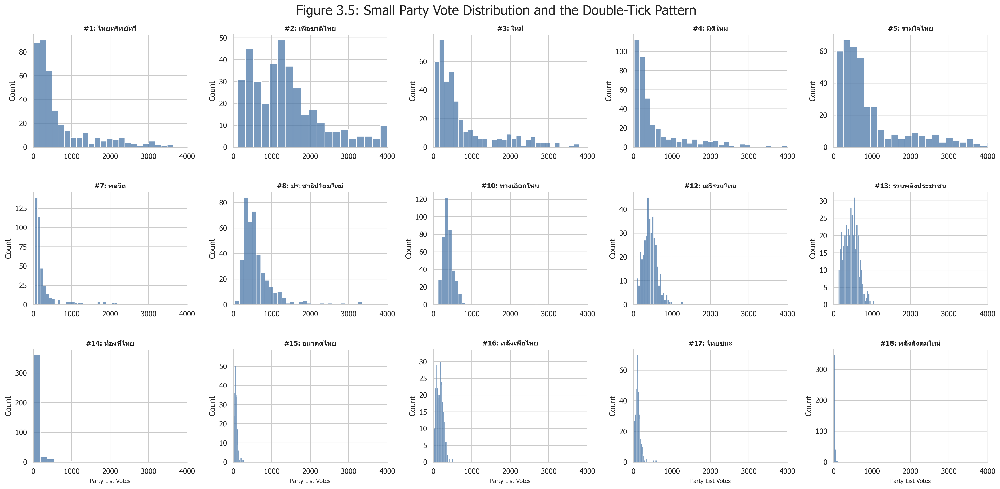

<em>รูปที่ 3.5 ลักษณะการกระจายคะแนนของพรรคขนาดเล็กที่ได้หมายเลข 1-18 </em>

  ในรูปที่ 3.5 แสดงการกระจายตัวของคะแนนเสียงของพรรคขนาดเล็ก (เช่น หมายเลข 1–18) ในภาพรวมของทั้งประเทศ โดยจะเห็นว่าคะแนนส่วนใหญ่กระจุกตัวอยู่ในระดับต่ำมากและลดลงอย่างรวดเร็ว อย่างไรก็ตาม บางเขตเลือกตั้งมีคะแนนที่พุ่งขึ้นสููงขึ้นผิดปกติ (spikes) ในบางพื้นที่ ซึ่งเป็นค่าที่สูงผิดปกติเมื่อเทียบกับแนวโน้มหลักของข้อมูล
รูปแบบนี้สะท้อนว่า คะแนนของพรรคขนาดเล็กไม่ได้เกิดจากความนิยม แต่เกิดจากเหตุการณ์เฉพาะพื้นที่ การที่ข้อมูลมีลักษณะนี้บ่งชี้ว่ามีกลไกบางอย่างที่บิดเบือนการกระจายคะแนน ดังนั้นรูปที่ 3.5 จึงเป็นหลักฐานเชิงประจักษ์เบื้องต้นที่สนับสนุนสมมติฐาน double-tick กล่าวคือ คะแนนเสียงของพรรคขนาดเล็กบางส่วนอาจไม่ได้เกิดจากความนิยมในพรรคเอง แต่เป็นผลจากการที่ผู้มีสิทธิเลือกตั้งเลือกหมายเลขเดียวกับผู้สมัครในเขตโดยไม่ตั้งใจ

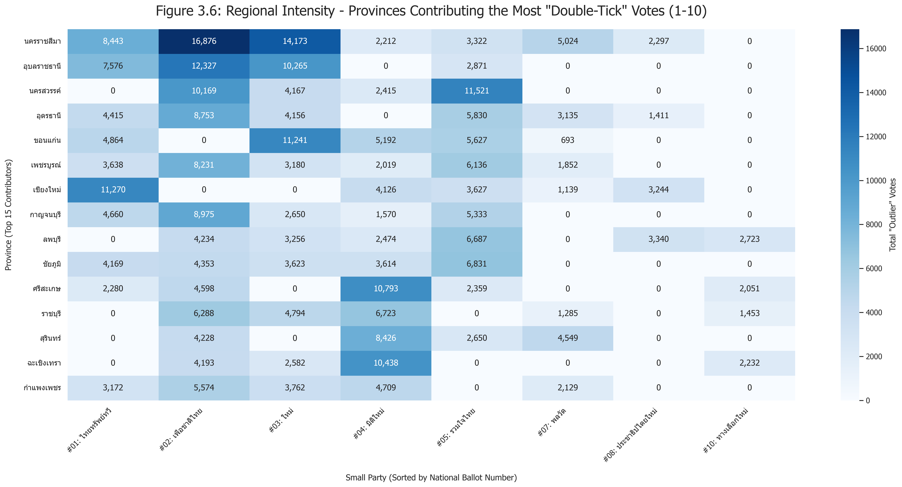

<em>รูปที่ 3.6 การกระจุกตัวของคะแนนที่ผิดปกติของพรรคขนาดเล็กในระดับภูมิภาค </em>

  ในรูปที่ 3.6 นี้ขยายผลจากรูปที่ 3.5 โดยพิจารณาการกระจายเชิงพื้นที่ของคะแนนที่พุ่งสูงผิดปกติ พบว่าคะแนน outlier ของพรรคขนาดเล็กไม่ได้กระจายแบบสุ่มทั่วประเทศ แต่มีการกระจุกตัวอยู่ในบางจังหวัดหรือบางพื้นที่อย่างชัดเจน พื้นที่เหล่านี้แสดงระดับคะแนนที่สูงกว่าค่าเฉลี่ยอย่างมีนัยสำคัญ ขณะที่พื้นที่อื่นยังคงมีคะแนนต่ำตามแนวโน้มปกติ
  การกระจุกตัวเชิงพื้นที่นี้เป็นหลักฐานสำคัญที่สนับสนุนเรื่อง double-tick ในระดับที่ลึกขึ้น เนื่องจากหากเป็นเพียงการลงคะแนนแบบสุ่ม คะแนนควรกระจายอย่างไม่มีรูปแบบ แต่การที่คะแนนพุ่งสูงเกิดใน “บางพื้นที่” บ่งชี้ว่ามีกลไกเชิงพฤติกรรมที่เชื่อมโยงกับบริบทท้องถิ่น เช่น การจดจำหมายเลขผู้สมัคร หรือการยึดโยงกับตัวบุคคล

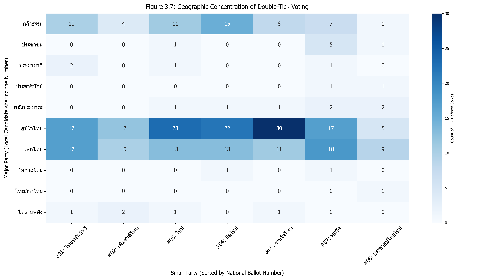

<em>รูปที่ 3.7 อิทธิพลของพรรคหลักต่อการเกิดคะแนนพุ่งของพรรคขนาดเล็ก</em>

  ในรูปที่ 3.7 วิเคราะห์ความเชื่อมโยงระหว่างพรรคขนาดใหญ่กับการเกิดคะแนนพุ่ง (vote spikes) ของพรรคขนาดเล็ก โดยพิจารณาว่าพื้นที่ที่เกิด outliers ของพรรคเล็กนั้น สัมพันธ์กับพรรคใดในระดับเขตเลือกตั้ง ผลลัพธ์แสดงให้เห็นว่า vote spikes ของพรรคขนาดเล็กมีความสัมพันธ์กับพื้นที่ที่พรรคขนาดใหญ่บางพรรคมีผู้สมัครที่แข็งแกร่ง โดยเฉพาะพรรคที่พึ่งพาผู้สมัครเชิงบุคคลสูง คะแนนที่ไหลไปยังพรรคขนาดเล็กไม่ได้เกิดขึ้นอย่างอิสระ แต่ถูก “ขับเคลื่อน” โดยฐานเสียงของพรรคขนาดใหญ่
  พรรคขนาดใหญ่ที่มีผู้สมัครนิยมสูงทำหน้าที่เสมือน “ตัวส่งผ่านคะแนน” ไปยังพรรคขนาดเล็กที่มีหมายเลขเดียวกันในบัตรบัญชีรายชื่อ
ดังนั้น ผลลัพธ์นี้สนับสนุนสมมติฐานว่า double-tick เป็นปรากฏการณ์ที่เกิดจาก interaction ระหว่าง “พฤติกรรมผู้เลือก” และ “โครงสร้างหมายเลขบัตรเลือกตั้ง”

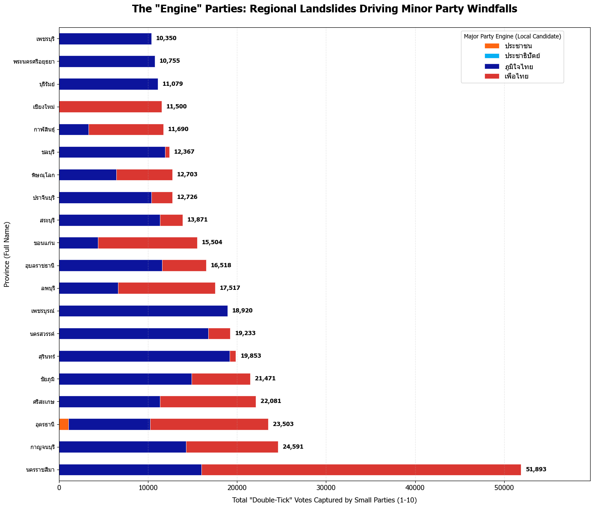

<em>รูปที่ 3.8 การซ้อนทับระหว่างฐานเสียงพรรคหลักกับผลกระทบจาก Double-Tick </em>

  รูปที่ 3.8 แสดงการซ้อนทับเชิงพื้นที่ระหว่างพื้นที่ฐานเสียงของพรรคขนาดใหญ่ กับพื้นที่ที่พรรคขนาดเล็กได้รับคะแนนสูงผิดปกติ จากภาพจะเห็นว่าพื้นที่ที่เกิด double-tick effects อย่างเข้มข้น มักสอดคล้องกับพื้นที่ที่พรรคขนาดใหญ่มีอิทธิพลสูงในระดับเขตเลือกตั้ง

  ผลการวิเคราะห์ชี้ให้เห็นว่า พฤติกรรมผู้มีสิทธิเลือกตั้งในประเทศไทยถูกกำหนดโดย 2 รูปแบบคือ การเลือกเชิงพรรค (party-centered) และการเลือกเชิงบุคคล (candidate-centered) ซึ่งกระจายตัวไม่เท่ากันตามภูมิศาสตร์ โดยเขตเมืองมีแนวโน้มยึดโยงกับพรรค ขณะที่ต่างจังหวัดยึดโยงกับตัวผู้สมัครเป็นหลัก
  ภายใต้ระบบบัตรเลือกตั้งสองใบ ความแตกต่างเชิงพฤติกรรมนี้นำไปสู่ความไม่สอดคล้องของการลงคะแนน และก่อให้เกิดปรากฏการณ์ “double-tick” โดยมีหลักฐานที่แสดงให้เห็นทั้งในรูปแบบการกระจายคะแนนที่ผิดปกติ (pattern), การกระจุกตัวเชิงพื้นที่ (geography), และกลไกการส่งผ่านคะแนนจากพรรคใหญ่ไปยังพรรคเล็ก (mechanism)

ข้อเสนอแนะ
1. การออกแบบบัตรเลือกตั้ง: ควรพิจารณาปรับรูปแบบบัตรเลือกตั้งเพื่อลดความสับสนระหว่าง “หมายเลขผู้สมัคร” และ “หมายเลขพรรค”
2. การให้ความรู้ผู้มีสิทธิเลือกตั้ง: ควรมีการสื่อสารเชิงรุกเพื่ออธิบายความแตกต่างของบัตรทั้งสองใบ และผลกระทบของการลงคะแนนแบบ double-tick
3. การออกแบบระบบเลือกตั้ง: อาจพิจารณาปรับกลไกให้ลดความเชื่อมโยงเชิงสัญลักษณ์ระหว่างสองบัตร
4. กลยุทธ์ของพรรคการเมือง: ปรับกลยุทธ์หาเสียงตามพฤติกรรมของประชาชนในแต่ละพื้นที่

  
